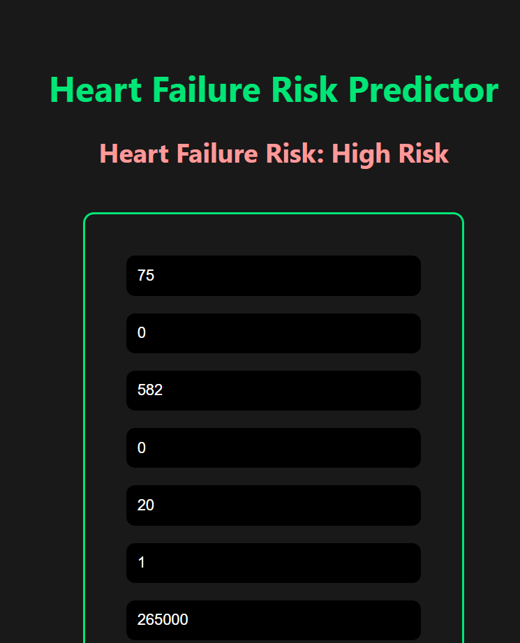
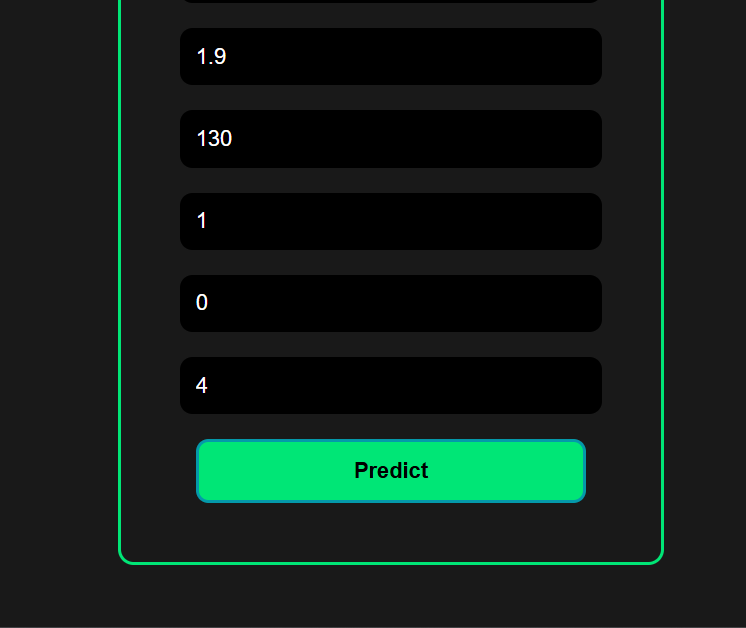

# Heart Failure Predictor

A simple and effective machine learning web app to predict the risk of heart failure using patient medical data. Built using Flask and trained with a classification model to achieve high accuracy.

## 🚀 Features

* Predicts risk of heart failure (High/Low)
* Takes user input via an HTML form
* Outputs both prediction and risk percentage
* Built with Flask backend and trained ML model

## 🧠 Model

The model was trained using the Heart Failure Clinical Records Dataset. It aims to predict the risk of heart failure based on the following features:

* Age
* Anaemia
* Creatinine Phosphokinase
* Diabetes
* Ejection Fraction
* High Blood Pressure
* Platelets
* Serum Creatinine
* Serum Sodium
* Sex
* Smoking
* Time (Follow-up period)

### 🎯 Accuracy

The model achieves over **80% accuracy** on the test set.

## 🗂️ Project Structure

```
heart-failure-predictor/
├── app.py                 # Flask backend
├── model.pkl             # Trained ML model
├── notebook.ipynb        # Jupyter Notebook for training
├── templates/
│   └── index.html        # Frontend HTML form
└── README.md             # Project documentation
```

## 💻 How to Run

1. Clone the repo:

   ```bash
   git clone https://github.com/yourusername/heart-failure-predictor.git
   cd heart-failure-predictor
   ```
2. Install dependencies:

   ```bash
   pip install -r requirements.txt
   ```
3. Run the Flask app:

   ```bash
   python app.py
   ```
4. Open `http://127.0.0.1:5000` in your browser.

## 📸 Screenshot




## 📁 Dataset Source

This project uses the publicly available [Heart Failure Clinical Records Dataset](https://www.kaggle.com/datasets/andrewmvd/heart-failure-clinical-data).

## 📜 License

This project is licensed under the [MIT License.](licence)