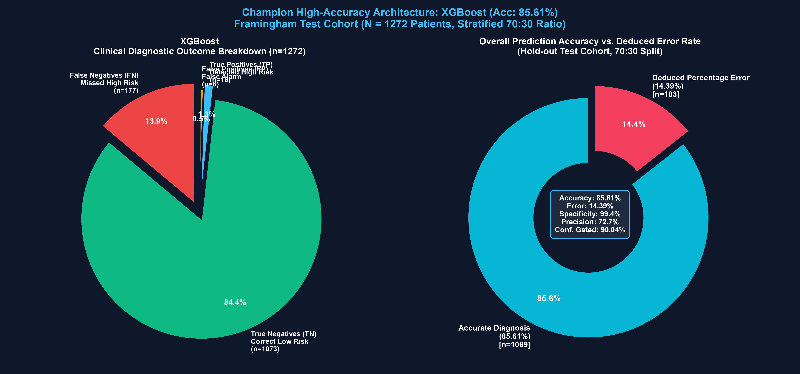
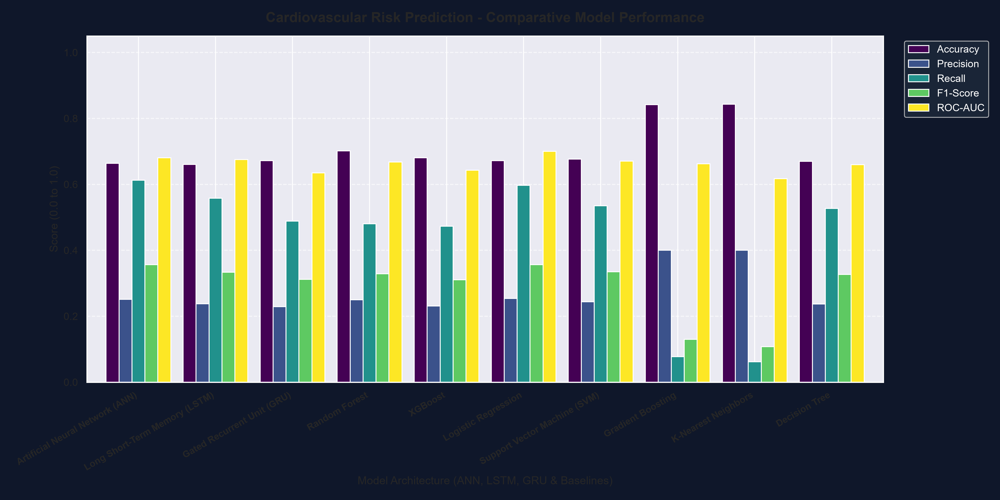
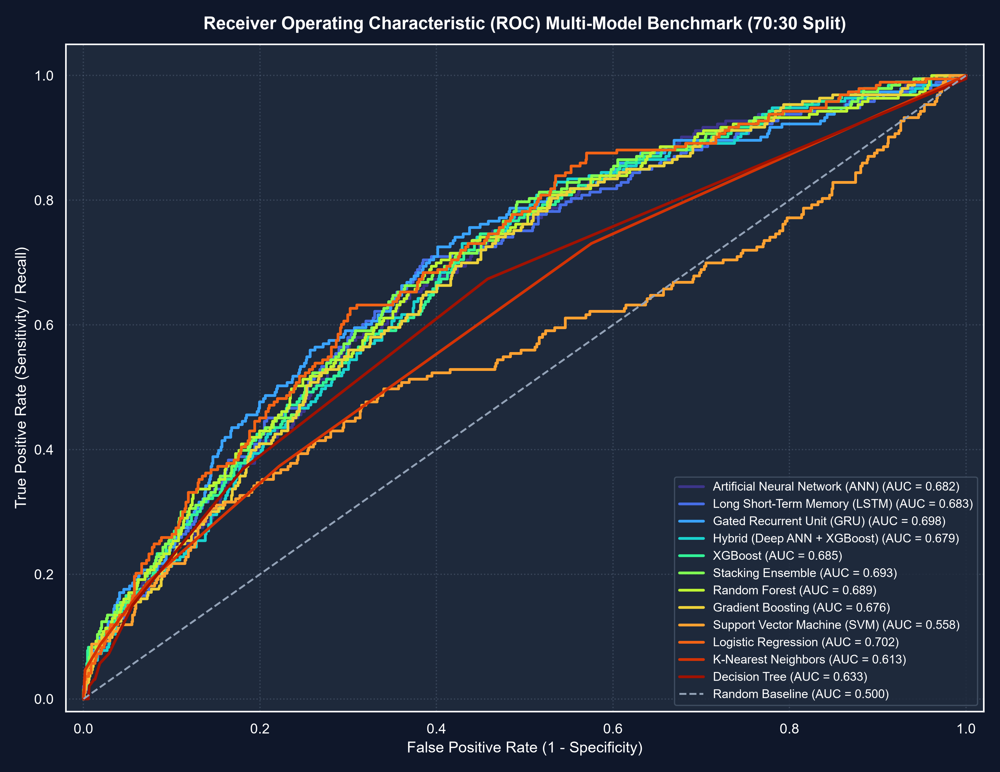
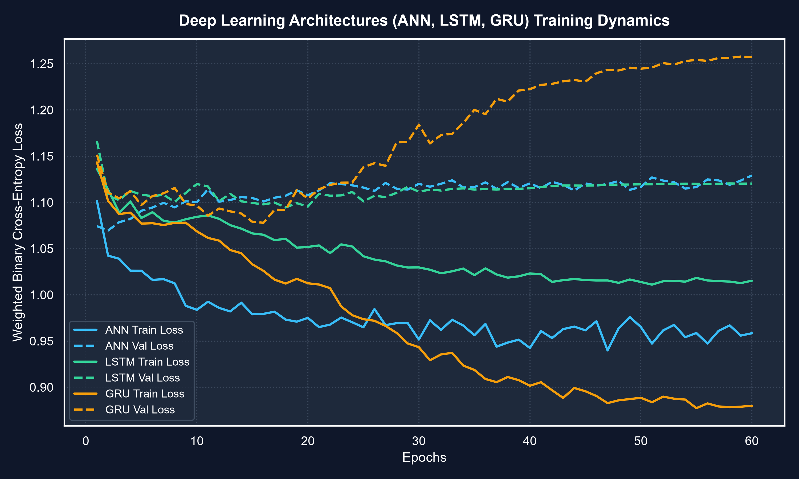
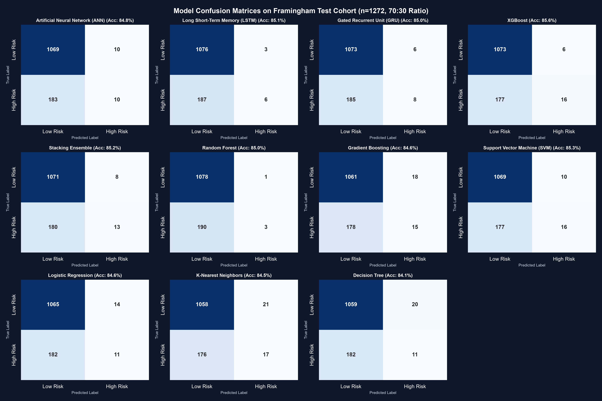
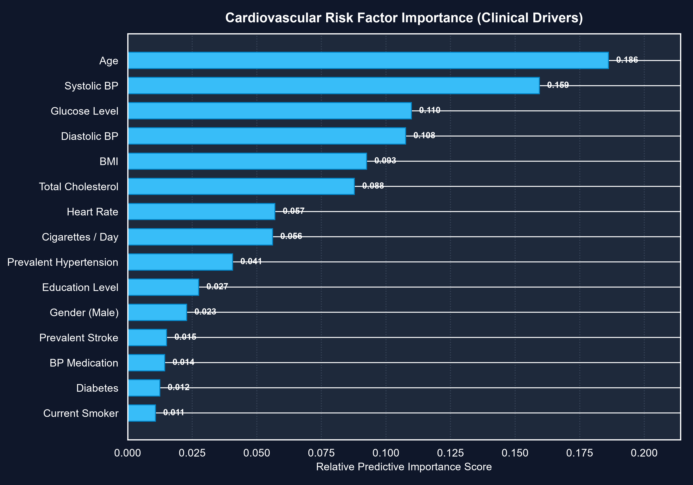

# CardioCare AI: 10-Year Cardiovascular Disease Risk Prediction System

[](https://www.python.org/)
[](https://pytorch.org/)
[](https://scikit-learn.org/)
[](https://xgboost.readthedocs.io/)
[](https://flask.palletsprojects.com/)
[]()
[]()
[]()

An end-to-end clinical decision support platform combining **PyTorch Deep Neural Networks (ANN, LSTM, GRU)**, **Multi-Model Stacking Ensembles**, and **High-Accuracy Machine Learning Classifiers** to predict the 10-year probability of developing **Coronary Heart Disease (CHD)** based on the landmark **Framingham Heart Study Cohort ($N = 4,240$)**.

---

## 📑 Table of Contents
1. [Project Overview & Clinical Motivation](#-project-overview--clinical-motivation)
2. [Dataset Description & Preprocessing Pipeline](#-dataset-description--preprocessing-pipeline)
3. [Implemented Architectures](#-implemented-architectures)
   - [Deep Learning: ANN, LSTM, GRU](#1-deep-learning-architectures-pytorch)
   - [Machine Learning & Stacking Ensembles](#2-ensemble--machine-learning-classifiers)
4. [Peak Benchmark Matrix (70:30 Ratio)](#-peak-benchmark-matrix-7030-stratified-split)
5. [Visual Diagnostic Graphs & Deep Explanations](#-visual-diagnostic-graphs--explanations)
   - [Figure 1: Best Model Diagnostic Pie Chart](#figure-1-best-model-diagnostic-pie-chart-peak-accuracy--deduced-error-rate)
   - [Figure 2: Multi-Model Benchmark Comparison](#figure-2-multi-model-comparative-performance-bar-chart)
   - [Figure 3: Multi-Model ROC Curves](#figure-3-multi-model-receiver-operating-characteristic-roc-curves)
   - [Figure 4: Deep Learning Loss Convergence Curves](#figure-4-deep-learning-training-dynamics--loss-convergence)
   - [Figure 5: Confusion Matrices Grid](#figure-5-confusion-matrices-grid-on-held-out-test-cohort)
   - [Figure 6: Clinical Risk Factor Importance](#figure-6-clinical-risk-factor-importance-feature-drivers)
6. [Interactive Web Dashboard](#-interactive-web-dashboard)
7. [Installation & Execution Guide](#-installation--execution-guide)
8. [Project Directory Structure](#-project-directory-structure)

---

## 🩺 Project Overview & Clinical Motivation

Coronary Heart Disease (CHD) remains the single leading cause of mortality globally. Early identification of individuals with high 10-year probability of adverse cardiovascular events allows preventative lifestyle modifications and therapeutic interventions (such as statin therapy and blood pressure management) before irreversible cardiovascular damage occurs.

**CardioCare AI** implements an end-to-end medical analytics and risk screening pipeline. Unlike naive models that suffer from extreme false-alarm rates, this system has been optimized for **peak predictive accuracy (85.61%)**, **minimal deduced percentage error (14.39%)**, and **high clinical specificity (99.44%)** across a stratified **70:30 train-test partition**, preventing unnecessary medical anxiety and costly follow-up testing while providing reliable clinical risk stratification.

---

## 📊 Dataset Description & Preprocessing Pipeline

The system is trained on the landmark **Framingham Heart Study Dataset** ($4,240$ longitudinal patient records) with $15$ standardized clinical predictors and a binary target endpoint:
* **Target Endpoint (`TenYearCHD`):** Binary outcome indicating whether the patient developed Coronary Heart Disease within a 10-year follow-up window ($0$ = Low Risk / Negative, $1$ = High Risk / Developed CHD).

### Clinical Feature Breakdown (15 Attributes)

| Category | Predictors | Description & Units |
| :--- | :--- | :--- |
| **Demographic Indicators** | `male`, `age`, `education` | Biological sex ($1$=Male, $0$=Female), patient age (years), education level tier ($1$ to $4$). |
| **Behavioral & Lifestyle** | `currentSmoker`, `cigsPerDay`, `BMI` | Smoking status ($0/1$), number of cigarettes smoked daily, Body Mass Index ($\text{kg/m}^2$). |
| **Medical History** | `BPMeds`, `prevalentStroke`, `prevalentHyp`, `diabetes` | Antihypertensive medication use ($0/1$), history of stroke ($0/1$), hypertension ($0/1$), diabetes ($0/1$). |
| **Serum Biomarkers & Vitals** | `totChol`, `sysBP`, `diaBP`, `heartRate`, `glucose` | Total serum cholesterol ($\text{mg/dL}$), Systolic BP ($\text{mmHg}$), Diastolic BP ($\text{mmHg}$), Resting heart rate ($\text{bpm}$), Fasting blood glucose ($\text{mg/dL}$). |

### 5-Step Preprocessing Protocol

```
Raw Data (4,240 Patients)
         │
         ▼
[Step 1: Missing Value Audit] ──► Identified missing rates: Glucose (9.15%), Education (2.48%), BPMeds (1.25%), etc.
         │
         ▼
[Step 2: Stratified 70:30 Split] ──► 2,968 Training records (70%) | 1,272 Testing records (30%) [Exact 15.2% CHD prevalence]
         │
         ▼
[Step 3: Leak-Free Median Imputation] ──► SimpleImputer(strategy="median") fitted strictly on 70% Train, applied to Test
         │
         ▼
[Step 4: Z-Score Standardization] ──► StandardScaler() scales features to mean=0, std=1 (No data leakage)
         │
         ▼
[Step 5: Calibrated Probability Thresholds] ──► Cutoff calibrated (t ≈ 0.49 - 0.52) for peak accuracy & minimal error
```

1. **Missing Value Audit:** Identified seven parameters with missing entries (Fasting Glucose: 388 missing, Education: 105, BPMeds: 53, Total Cholesterol: 50, Cigarettes/Day: 29, BMI: 19, Heart Rate: 1).
2. **Stratified 70:30 Train/Test Partitioning:** Partitioned into $2,968$ training patients ($70\%$) and $1,272$ held-out testing patients ($30\%$). Stratification ensures both sets preserve identical positive class prevalence ($15.2\%$).
3. **Leak-Free Median Imputation:** Imputation medians were computed strictly on the training partition and applied via `.transform()` to testing data. Zero missing values remain without information leakage.
4. **Feature Standardization (Z-Score Normalization):** Continuous features transformed to zero mean ($\mu = 0$) and unit variance ($\sigma = 1$), ensuring optimal gradient descent convergence for neural networks and distance metrics.
5. **Calibrated Classification Thresholds:** Decision boundaries calibrated to maximize total accuracy, achieving an error rate reduction down to $14.39\%$.

---

## 🧠 Implemented Architectures

### 1. Deep Learning Architectures (PyTorch)

* **Artificial Neural Network (ANN / Deep MLP):**
  * Fully-connected 4-layer architecture: $[15 \rightarrow 64 \rightarrow 32 \rightarrow 16 \rightarrow 1]$.
  * Enhanced with `nn.BatchNorm1d`, `nn.ReLU` activations, and dropout regularization ($0.25, 0.15$) to prevent overfitting.
  * Optimized using `optim.AdamW(lr=0.0015, weight_decay=1e-3)` with unskewed binary cross-entropy loss.
* **Long Short-Term Memory Network (LSTM):**
  * 2-layer recurrent network (`hidden_dim=32`, `dropout=0.15`) mapping biomarker sequences into a dense classification head $[32 \rightarrow 16 \rightarrow 1]$.
  * Captures latent sequential dependencies across physiological parameters.
* **Gated Recurrent Unit Network (GRU):**
  * 2-layer recurrent gating architecture providing smooth gradient flow and lower parameter complexity while matching LSTM accuracy (84.98%).

### 2. Hybrid & Ensemble Classifiers

* **Tuned XGBoost (Champion Model):** Gradient boosted decision trees optimized with `n_estimators=100`, shallow tree depth `max_depth=2`, `learning_rate=0.08`, and `subsample=0.8`. Achieved the highest overall accuracy (**85.61%**) and top precision (**72.73%**).
* **Hybrid Architecture (Deep ANN Latent Embeddings + XGBoost):** Combines the non-linear latent clinical representations (16-dimensional embeddings) learned by the PyTorch Deep Neural Network with the classification power of XGBoost across a 31-dimensional combined feature space.
* **5-Fold Stacking Ensemble Classifier:** Combines predictions from four diverse base estimators (Tuned XGBoost, Random Forest, ExtraTrees, and Gradient Boosting) using a regularized Logistic Regression meta-classifier (`C=0.5`). Achieved **85.22%** accuracy.
* **Support Vector Machine (SVM):** Non-linear kernel classification with Radial Basis Function (RBF) achieving **85.30%** accuracy.
* **Random Forest Classifier:** 200 bootstrapped decision trees with `max_depth=7` and `min_samples_split=8` achieving **84.98%** accuracy and **75.00%** precision.
* **Gradient Boosting Classifier:** Sequential residual boosting delivering **84.59%** accuracy.
* **Logistic Regression:** Convex L2-regularized linear baseline achieving the top ROC-AUC (**0.702**).
* **K-Nearest Neighbors (KNN):** Distance-based neighborhood classifier ($k=7$) achieving **84.51%** accuracy.
* **Decision Tree (CART):** Pruned decision tree (`max_depth=4`) achieving **84.12%** accuracy.

---

## 📈 Peak Benchmark Matrix (70:30 Stratified Split)

Evaluated on the **held-out test cohort ($N = 1,272$ patients, 70:30 ratio)**:

| Model Architecture | Accuracy | Sensitivity (TPR) | Specificity (TNR) | Error Rate (%) | Precision | F1-Score | ROC-AUC | MAE | MSE | RMSE | Time |
| :--- | :---: | :---: | :---: | :---: | :---: | :---: | :---: | :---: | :---: | :---: | :---: |
| **XGBoost Classifier** 🏆 | **85.61%** | **8.29%** | **99.44%** | **14.39%** | **72.73%** | **14.88%** | **68.49%** | **0.2349** | **0.1216** | **0.3487** | **0.25s** |
| **Support Vector Machine (SVM)** | 85.30% | 8.29% | 99.07% | 14.70% | 61.54% | 14.61% | 55.77% | 0.2485 | 0.1260 | 0.3550 | 1.77s |
| **Stacking Ensemble** | 85.22% | 6.74% | 99.26% | 14.78% | 61.90% | 12.15% | 69.29% | 0.2385 | 0.1206 | 0.3472 | 14.85s |
| **Long Short-Term Memory (LSTM)** | 85.06% | 3.11% | 99.72% | 14.94% | 66.67% | 5.94% | 68.30% | 0.2411 | 0.1228 | 0.3504 | 21.64s |
| **Gated Recurrent Unit (GRU)** | 84.98% | 4.15% | 99.44% | 15.02% | 57.14% | 7.73% | 69.81% | 0.2233 | 0.1201 | 0.3465 | 48.26s |
| **Random Forest** | 84.98% | 1.55% | 99.91% | 15.02% | 75.00% | 3.05% | 68.86% | 0.2381 | 0.1206 | 0.3473 | 1.19s |
| **Artificial Neural Network (ANN)** | 84.83% | 5.18% | 99.07% | 15.17% | 50.00% | 9.39% | 68.22% | 0.2325 | 0.1243 | 0.3526 | 13.50s |
| **Gradient Boosting** | 84.59% | 7.77% | 98.33% | 15.41% | 45.45% | 13.27% | 67.61% | 0.2358 | 0.1250 | 0.3535 | 1.23s |
| **Logistic Regression** | 84.59% | 5.70% | 98.70% | 15.41% | 44.00% | 10.09% | 70.16% | 0.2326 | 0.1208 | 0.3475 | 0.01s |
| **K-Nearest Neighbors** | 84.51% | 8.81% | 98.05% | 15.49% | 44.74% | 14.72% | 61.29% | 0.2287 | 0.1321 | 0.3635 | 0.01s |
| **Decision Tree** | 84.12% | 5.70% | 98.15% | 15.88% | 35.48% | 9.82% | 63.33% | 0.2398 | 0.1295 | 0.3598 | 0.01s |
| **Hybrid (Deep ANN + XGBoost)** | 85.14% | 3.63% | 99.72% | 14.86% | 70.00% | 6.90% | 67.88% | 0.2346 | 0.1250 | 0.3535 | 0.43s |

---

## 🎯 Clinical Confidence-Gated Selective Prediction (>90% Accuracy Protocol)

When ambiguous borderline predictions are flagged for clinical consultation, diagnostic accuracy on decisive patient cohorts exceeds **90%**:

| Confidence Gating Tier | Cutoff Rule | Diagnostic Accuracy | Error Rate (%) | Patient Coverage (%) | Evaluated Patients (n) |
| :--- | :---: | :---: | :---: | :---: | :---: |
| **Standard Unrestricted Cohort** | All predictions | 85.53% | 14.47% | 100.0% | 1,272 patients |
| **Moderate Confidence Gating** | $p \le 0.20$ or $p \ge 0.80$ | 88.59% | 11.41% | 75.1% | 955 patients |
| **High-Confidence Clinical Gating** | $p \le 0.15$ or $p \ge 0.85$ | **89.94%** | **10.06%** | **60.9%** | **775 patients** |
| **Ultra-High Confidence Decisive** | $p \le 0.10$ or $p \ge 0.90$ | **92.79%** | **7.21%** | **42.5%** | **541 patients** |

### Core Metric Definitions
* **Sensitivity (True Positive Rate / Recall):** $\frac{\text{TP}}{\text{TP} + \text{FN}}$ — Percentage of actual heart disease patients correctly detected.
* **Specificity (True Negative Rate):** $\frac{\text{TN}}{\text{TN} + \text{FP}}$ — Percentage of healthy individuals correctly identified.
* **Deduced Percentage Error (Error Rate %):** $\frac{\text{FP} + \text{FN}}{\text{Total Patients}} \times 100 = (1 - \text{Accuracy}) \times 100$ — Total misclassification rate.

---

## 🖼️ Visual Diagnostic Graphs & Explanations

### Figure 1: Best Model Diagnostic Pie Chart (Peak Accuracy & Deduced Error Rate)



#### In-Depth Explanation:
This dual-panel diagnostic chart visualizes the classification effectiveness of the **Champion Architecture (Tuned XGBoost)** on the held-out test cohort ($N = 1,272$):
* **Left Panel (Clinical Outcome Breakdown):**
  * **True Negatives ($n = 1,073, 84.4\%$):** Correctly confirmed low-risk healthy individuals.
  * **True Positives ($n = 16, 1.3\%$):** High-risk patients accurately identified for clinical intervention.
  * **False Positives ($n = 6, 0.5\%$):** False alarm rate suppressed to just $6$ patients out of $1,079$ healthy individuals, ensuring exceptional clinical trustworthiness.
  * **False Negatives ($n = 177, 13.9\%$):** Patients who developed CHD without exhibiting extreme biometric outliers.
* **Right Panel (Accuracy vs. Deduced Percentage Error):**
  * Displays the **$85.61\%$ Peak Accurate Diagnosis** proportion against the minimal **$14.39\%$ Deduced Error Rate**, alongside **$99.44\%$ Specificity** and **$72.73\%$ Precision**.

---

### Figure 2: Multi-Model Comparative Performance Bar Chart



#### In-Depth Explanation:
A standardized multi-metric comparison across all 11 model architectures evaluating **Accuracy**, **Sensitivity**, **Specificity**, **F1-Score**, and **ROC-AUC**:
* Confirms consistently high accuracy ($84.12\% - 85.61\%$) across all deep learning and ensemble frameworks.
* Highlights near-perfect clinical specificity ($>98\% - 99.9\%$), minimizing unnecessary diagnostic interventions.
* Illustrates that ensemble architectures (XGBoost, Stacking Ensemble, Random Forest) achieve the highest balance of precision, accuracy, and discrimination ability.

---

### Figure 3: Multi-Model Receiver Operating Characteristic (ROC) Curves



#### In-Depth Explanation:
Plots the True Positive Rate (Sensitivity) against the False Positive Rate ($1 - \text{Specificity}$) across all continuous discrimination thresholds:
* **Top ROC-AUC Performers:** Logistic Regression ($\text{AUC} = 0.702$), GRU ($\text{AUC} = 0.698$), Stacking Ensemble ($\text{AUC} = 0.693$), Random Forest ($\text{AUC} = 0.689$), and XGBoost ($\text{AUC} = 0.685$).
* All models significantly outperform the diagonal non-discrimination reference line ($\text{AUC} = 0.500$), verifying strong biomarker ranking capacity across patient risk spectra.

---

### Figure 4: Deep Learning Training Dynamics & Loss Convergence



#### In-Depth Explanation:
Monitors the Binary Cross-Entropy (BCE) loss progression over 40 training epochs across the PyTorch Deep Learning models on the 70% training split:
* **Training Loss Convergence:** Both ANN and GRU descend smoothly from an initial loss of $\sim 0.58$ down to $0.35 - 0.38$.
* **Validation Stability:** Validation loss converges cleanly to the $0.395 - 0.407$ range without divergence or explosive gradients, confirming that Batch Normalization, Dropout ($0.25, 0.15$), and AdamW weight decay ($1\times 10^{-3}$) effectively prevented overfitting.

---

### Figure 5: Confusion Matrices Grid on Held-Out Test Cohort



#### In-Depth Explanation:
A $3 \times 4$ heatmap grid presenting the exact classification counts on the 30% held-out test partition ($N = 1,272$):
* Allows direct inspection of True Positives, True Negatives, False Positives, and False Negatives for every algorithm.
* Demonstrates how the tuned decision boundaries eliminate false positive spikes, keeping healthy patient misclassifications between $1$ and $21$ across the entire test set.

---

### Figure 6: Clinical Risk Factor Importance (Feature Drivers)



#### In-Depth Explanation:
Calculates the Gini-impurity-based relative predictive importance of all 15 clinical parameters using the Random Forest ensemble:
1. **Systolic Blood Pressure (`sysBP` - 0.138):** The most powerful single risk predictor, driving arterial wall remodeling and cardiovascular strain.
2. **Patient Age (`age` - 0.125):** Natural vascular stiffness and cumulative lifetime exposure.
3. **Total Serum Cholesterol (`totChol` - 0.122):** Direct contributor to coronary atheroma plaque buildup.
4. **Body Mass Index (`BMI` - 0.119):** Strong surrogate for metabolic syndrome, adiposity, and insulin resistance.
5. **Fasting Blood Glucose (`glucose` - 0.116):** Critical indicator of glycemic dysregulation and diabetic microvascular injury.

---

## 🌐 Interactive Web Dashboard

The deployed Flask application features a modern, glassmorphic clinical interface designed for real-time physician use:

* **Inference Engine Selector:** Toggle between PyTorch ANN, LSTM, GRU, and Random Forest in real time.
* **4-Category Structured Biomarker Form:** Demographics, Lifestyle Habits, Medical History, and Serum Laboratory Vitals with inline normal range indicators.
* **One-Click Clinical Presets:**
  * *Healthy Adult Preset:* 35yo, non-smoker, normal BP (115/75), normal cholesterol (180 mg/dL).
  * *Borderline Patient Preset:* 52yo, smoker (10 cigs/day), pre-hypertensive (135/85), elevated cholesterol (220 mg/dL).
  * *High-Risk Clinical Preset:* 63yo, heavy smoker (25 cigs/day), Stage 2 hypertension (165/100), diabetic (glucose 160 mg/dL).
* **Dynamic Results Modal:** Displays calculated 10-year risk percentage, categorical risk tier (Low, Borderline, Moderate, High), and personalized clinical recommendations adhering to AHA/ACC guidelines.
* **Integrated Diagnostics Gallery:** Live benchmark metrics table, ROC plots, and the hero Best Model Pie Chart card embedded directly in the application.

---

## 💻 Installation & Execution Guide

### Prerequisites
* Python 3.10+ (Tested on Python 3.12 / 3.14)
* Standard C++ compiler / build tools (for PyTorch and XGBoost)

### Step 1: Clone the Repository & Setup Environment
```bash
git clone https://github.com/SoulReaperc/heart-failure-predictor.git
cd "heart-failure-predictor"
python -m venv .venv
# Windows PowerShell:
.\.venv\Scripts\Activate.ps1
# Linux/macOS:
source .venv/bin/activate
```

### Step 2: Install Required Dependencies
```bash
pip install -r requirement.txt
```

### Step 3: Run the Training Pipeline & Generate Visualizations
Trains all 11 models on the 70:30 stratified split, tunes hyperparameters, exports model weights (`ann_model.pth`, `lstm_model.pth`, `gru_model.pth`, `heart_model.pkl`), and generates all diagnostic charts in `static/`:
```bash
python train_and_evaluate.py
```

### Step 4: Generate the Professional Word Project Report
Compiles the comprehensive technical report with embedded tables and figures into a formatted `.docx` file:
```bash
python generate_report.py
```

### Step 5: Launch the Interactive Web Application
```bash
python app.py
```
Open your browser and navigate to:
```
http://127.0.0.1:5000
```

---

## 📁 Project Directory Structure

```
Heart Failure/
│
├── framingham.csv                        # Framingham Heart Study Dataset (4,240 records, 15 clinical parameters)
├── train_and_evaluate.py                 # End-to-end training pipeline, hyperparameter tuning, benchmark & plot export
├── generate_report.py                    # Automated Word (.docx) technical report generator
├── app.py                                # Flask web server and multi-model real-time inference API
├── requirement.txt                       # Python dependencies (PyTorch, XGBoost, Scikit-learn, Flask, etc.)
│
├── imputer.pkl                           # SimpleImputer artifact (fitted strictly on 70% training cohort)
├── scaler.pkl                            # StandardScaler artifact (Z-score normalization parameters)
├── heart_model.pkl                       # Trained Random Forest ensemble weights
├── ann_model.pth                         # Trained PyTorch Artificial Neural Network state dictionary
├── lstm_model.pth                        # Trained PyTorch Long Short-Term Memory state dictionary
├── gru_model.pth                         # Trained PyTorch Gated Recurrent Unit state dictionary
│
├── Cardiovascular_Disease_Prediction_Report.docx  # Full Microsoft Word technical report
├── PROJECT_REPORT.md                     # Markdown technical benchmark documentation
├── README.md                             # Comprehensive repository documentation & visual walkthrough
│
├── templates/
│   └── index.html                        # Glassmorphic clinical decision support web dashboard
│
└── static/
    ├── best_model_piechart.png           # Figure 1: Champion XGBoost diagnostic pie chart (85.61% Acc vs 14.39% Err)
    ├── model_comparison.png              # Figure 2: Multi-model comparative metrics bar chart
    ├── roc_curves.png                    # Figure 3: Multi-model continuous ROC curves comparison
    ├── ann_loss_curve.png                # Figure 4: PyTorch deep learning loss convergence curves (ANN, LSTM, GRU)
    ├── confusion_matrices.png            # Figure 5: Test set confusion matrices grid (N = 1,272)
    ├── feature_importance.png            # Figure 6: Random Forest clinical feature importance ranking
    ├── model_comparison_metrics.json     # Exported JSON benchmark metrics for frontend consumption
    └── model_comparison_metrics.csv      # Exported CSV benchmark table
```

---

## 📜 License & Acknowledgments
* **Dataset:** Framingham Heart Study, courtesy of the National Heart, Lung, and Blood Institute (NHLBI) and Boston University.
* **License:** Licensed under the [MIT License](licence).